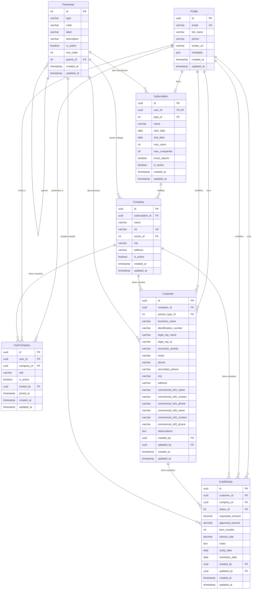

# Diagrama de Base de Datos

## Diagrama ER (Mermaid)

> Para visualizar: copia el bloque mermaid y pegalo en [mermaid.live](https://mermaid.live)
> o instala la extension "Markdown Preview Mermaid Support" en VS Code y haz preview de este archivo.

## Como visualizar

1. **mermaid.live** (recomendado): Ve a [mermaid.live](https://mermaid.live), pega el bloque de codigo mermaid
2. **VS Code**: Instala la extension "Markdown Preview Mermaid Support", luego abre este archivo y presiona `Ctrl+Shift+V`
3. **GitHub**: Si subes este archivo a GitHub, el diagrama se renderiza automaticamente
